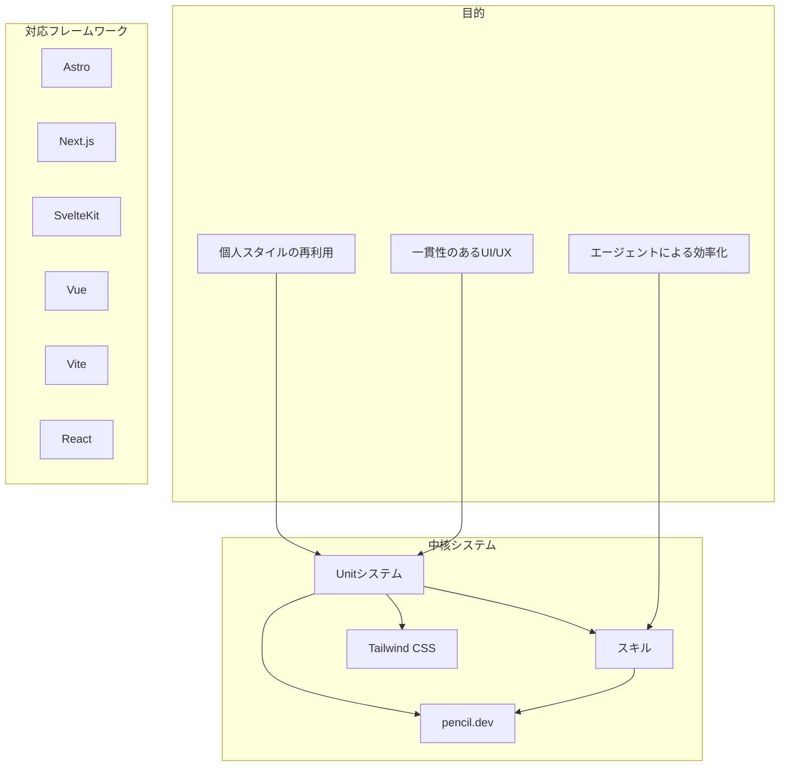
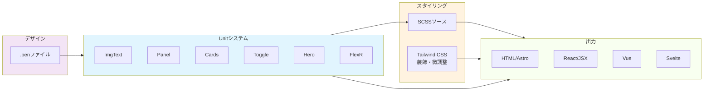
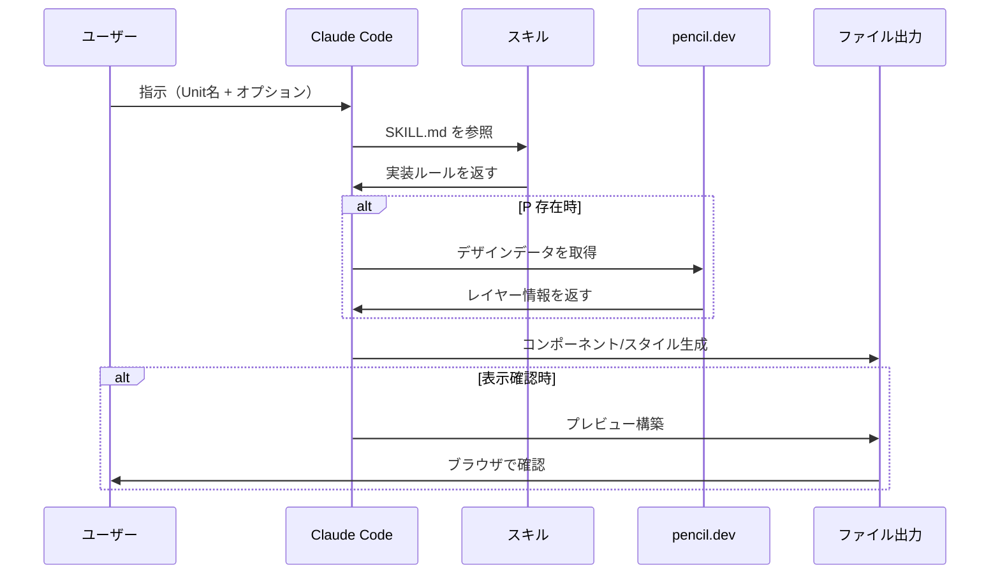
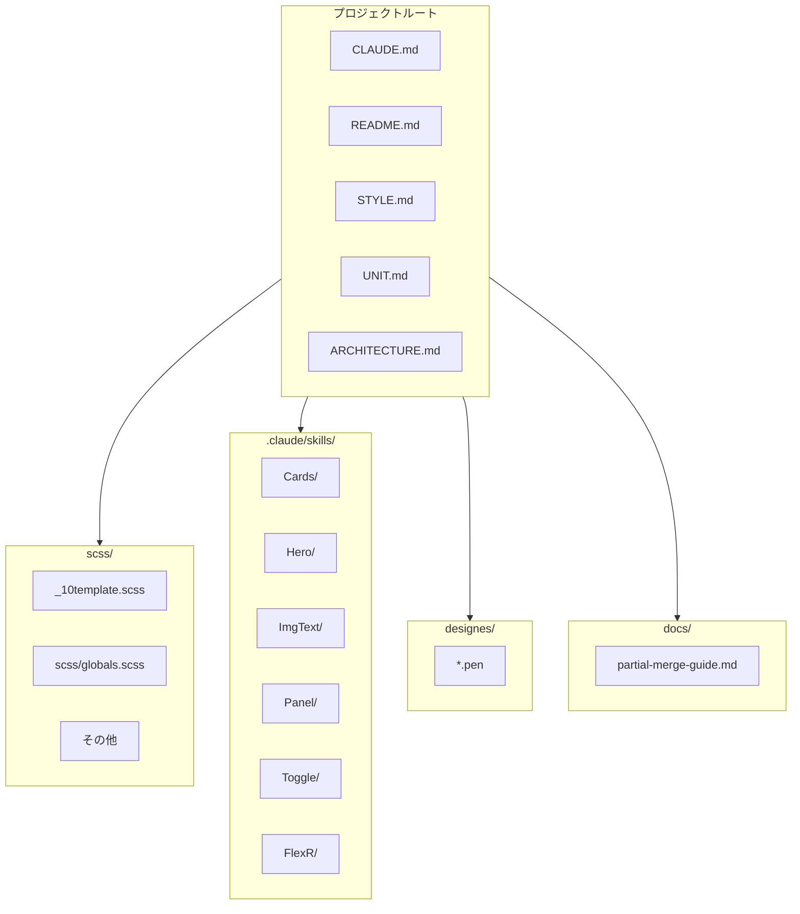

# BYOS React アーキテクチャ

Burn Your Own Style プロジェクトの全体像。

---

## システム概要図

---

## Unit と周辺システムの関係

---

## ワークフロー図

---

## ディレクトリ構成

---

## Unit 一覧

| Unit | 用途 | スキル |
|------|------|--------|
| ImgText | 画像とテキストの横並び | `/ImgText` |
| Panel | 縦並びコンテナ | `/Panel` |
| Cards | カードグリッド | `/Cards` |
| Toggle | 開閉コンテンツ | `/Toggle` |
| Hero | メインビジュアル | `/Hero` |
| FlexR | 比率分割レイアウト | `/FlexR` |

---

## 役割分担

| 役割 | 担当 |
|------|------|
| レイアウト骨格 | **Unit** |
| 装飾・色・微調整 | **Tailwind CSS** |
| デザイン参照 | **pencil.dev (.pen)** |
| 実装ルール | **スキル (SKILL.md)** |
